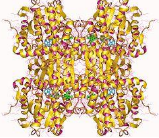

# Bioinformatics-Genomic-signal-processing-
##  NZ_CP014692.1 Acetobacter aceti
### Overview of the protein gene chosen to be common in all the accessions of bacterial species
## Adenosylhomocysteinase

Is an enzyme that converts S-adenosylhomocysteine to homocysteine and adenosine. This enzyme catalyses the
following chemical reaction 
S-adenosyl-L-homocysteine + H2O ⇌ L-homocysteine + adenosine 
The enzyme contains one tightly bound NAD+ per subunit.

## Distance Matrix

## Phylogenetic Trees
## WMPGA Tree
Given below is the Newick Format of the WPGMA output tree. In this format, the number following the organism or
group denotes the distance to its parent 
**((((((NZ_CP022699.1/CP022699.1:0.50,NZ_LN606600.1/LN606600.1:0.50):5,NZ_CP014687.1/CP0146
87.1:5.50):0.57,((((NZ_CP015164.1:0.00,NZ_CP015168.1:0.00):0,NZ_CP021524.1:0.00):1,((((((((NC_0
17150.1/AP011163.1:0.00,NC_017108.1/AP011170.1:0.00):0,NC_013209.1/AP011121.1:0.00):0,NC_017
125.1/AP011142.1:0.00):0,NC_017100.1/AP011128.1:0.00):0,NC_017121.1/AP011135.1:0.00):0,NC_01
7146.1/AP011149.1:0.00):0,NC_017111.1/AP011156.1:0.00):0,NZ_AP014881.1/AP014881.1:0.00):1):0.
47,((NZ_CP022374.1/CP022374.1:0.00,NZ_CP023189.1/CP023189.1:0.00):0.25,(NZ_CP023657.1/CP02
3657.1:0.00,NZ_CP011120.1/CP011120.1:0.00):0.25):1.22):4.6):0.37,NZ_LN609302.1:6.44):0.53,NZ_A
P018515.1/AP018515.1:6.97):3.12,NZ_CP014692.1:10.09)**

### Discussion

When we considering the WPGMA, it assumes constant rate of evolution. Therefore, the distance from the root to leaf
nodes are equal in length. This can be observed by the above figure.

- When we observe the accession numbers corresponding to Acetobacter oryzifermentans and Acetobacter
pomorum we can observe that they are branched from the common node. So that they are evolved from a
common ancestor. So that there is a complete or almost complete similar in between different strains of their
own species.

- When we observe the accession numbers corresponding to acetobacter tropicalis and acetobacter senaglensis,
there is a significant similarity. Therefore we can assume that they have performed some amount of acquiring
of genes through horizontal gene transfer

- We can observe that Acetobacter aceti seems to involve independently, from the most initial ancestor of this
phylogenetic tree, and it has the maximum genetic tree. The reason for that is it has not undergone any stage of
gene transfer with the other species in its genus. 

## Neighbour Joining Tree
Given below is the Newick Format of the NJ output tree. In this format, the number following the organism or group
denotes the distance to its parent. 

**((((((((((((((NZ_CP022374.1/CP022374.1:0.00,NZ_CP023189.1/CP023189.1:0.00):0.08,NZ_CP011120.1
/CP011120.1:-
0.08):0.23,NZ_CP023657.1/CP023657.1:0.27):1.49,(((NZ_AP018515.1/AP018515.1:7.81,NZ_LN609302
.1:5.19):0.59,(NZ_CP014687.1/CP014687.1:4.21,NZ_CP014692.1:12.79):1.41):0.41,(NZ_CP022699.1/CP02
2699.1:0.75,NZ_LN606600.1/LN606600.1:0.25):4.84):4.92):0.33,((NZ_CP015168.1:0.00,NZ_CP021524.1:0.
00):0.02,NZ_CP015164.1:-0.02):1.12):0.84,NZ_AP014881.1/AP014881.1:-
0.05):0.05,NC_017150.1/AP011163.1:0.00):0.00,NC_017108.1/AP011170.1:0.00):0.00,NC_013209.1/AP
011121.1:0.00):0.00,NC_017125.1/AP011142.1:0.00):0.00,NC_017100.1/AP011128.1:0.00):0.00,NC_017
121.1/AP011135.1:0.00):0.00,NC_017146.1/AP011149.1:0.00),NC_017111.1/AP011156.1:0)**

### Discussion

The tips of the branches in the Neighbor-joining tree does not align with each other, the reason for that is constant rate
of evolution is not assumed here, as opposed to the WPGMA tree. Neighbour-joining algorithm commonly used for the
construct phylogenetic trees. When create phylogenetic tree we considered the distance from one organism to all the
other organisms. Further create tree using identity matrix due values are normalized.

- In the NJ tree, Acetobacter pasteurianus have branched immediately after the earliest common ancestor. Further
we can see that genetic distance is very small compared to others.
- When we observe accession numbers of Acetobacter oryzifermentans and Acetobacter pomorum pattern
similar to that of WPGMA tree observed. So that we can conclude a possibility of horizontal transfer gene.
- Acetobacter ghanensis, Acetobacter persici, Acetobacter aceti, Acetobacter orientalis all have evolved from
the same ancestor, but have long genetic distance.
- Acetobacter tropicalis, Acetobacter seneglensis appears to be having significant amount of similarity as
distance are very closer.

## Conclusion

The WPGMA and the NJ trees are used to study gene evolution. When we compare WPGMA tree and NJ tree, NJ tree
provides better results that the WPGMA tree. With the above observations we can come in to following conclusions.

- Acetobacter oryzifermentans and Acetobacter pomorum have undergone horizontal gene transfer
- Acetobacter ghanensis, Acetobacter persici, Acetobacter aceti, Acetobacter orientalis have undergone
horizontal gene transfer.

## References

1. https://en.wikipedia.org/wiki/Adenosylhomocysteinase
2. Newick Standard for representing trees. [Online]. Available:
http://evolution.genetics.washington.edu/phylip/newicktree.html
3. Figtree Software, 2018. [Online]. Available: http://tree.bio.ed.ac.uk/software/figtree/
